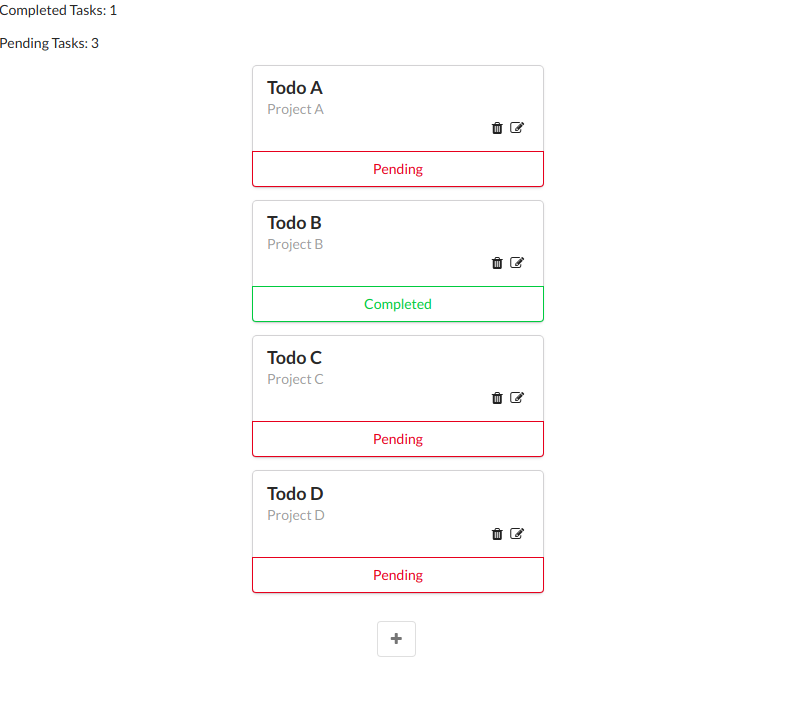

# todo-app
[](https://app.codacy.com/manual/tiagopaes37/to-do-list?utm_source=github.com&utm_medium=referral&utm_content=tiagopaes/to-do-list&utm_campaign=Badge_Grade_Dashboard)
[](https://travis-ci.org/tiagopaes/to-do-list)

> A simple and useful to do list app made with Vue.js

[Live app!](https://tiagopaes.github.io/to-do-list/)



## Build Setup

``` bash
# install dependencies
npm install

# serve with hot reload at localhost:8080
npm run dev

# build for production with minification
npm run build

# build for production and view the bundle analyzer report
npm run build --report
```

For a detailed explanation on how things work, check out the [guide](http://vuejs-templates.github.io/webpack/) and [docs for vue-loader](http://vuejs.github.io/vue-loader).
